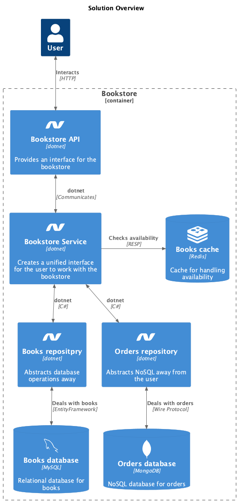

# Compulsory assignment 2

## Helicopter overview

A user will only see an API endpoint, with the basic operations for using a bookstore
The endpoint talks to a service layer that handles whatever logic there might be involved in an operation. Sometimes the logic is nothing more than relaying data on to a repository layers that handles CRUD operations with various databases

## Tech stack

The books, authors and customers, are stored in a relational database. If one would be eager to normalize the model even further, authors and customers are people, and could act as both entities. But in this datamodel they are two different things. The C# Models do extend a Person class, just for fun

Orders are stored in a MongoDB, because it made it easy to append books to an order. It seemed like a good place to introduce a document model, because an order could be seen as an isolated entity. And magic like "Get a discount when you order 10 books", seems easyer to implement in a model like that

Finaly there is a cache implemented in Redis. It keeps tracks of books availability. 

Here is a diagram of the entire solution:

